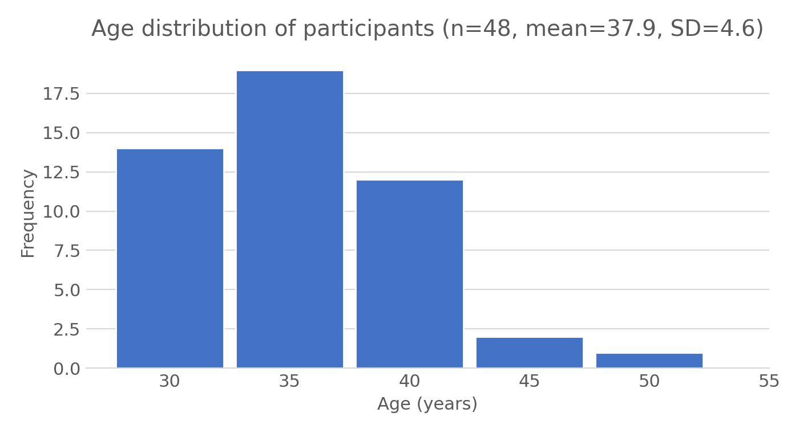
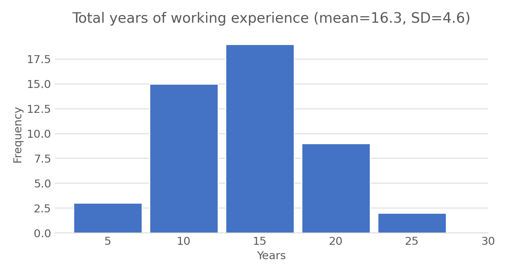
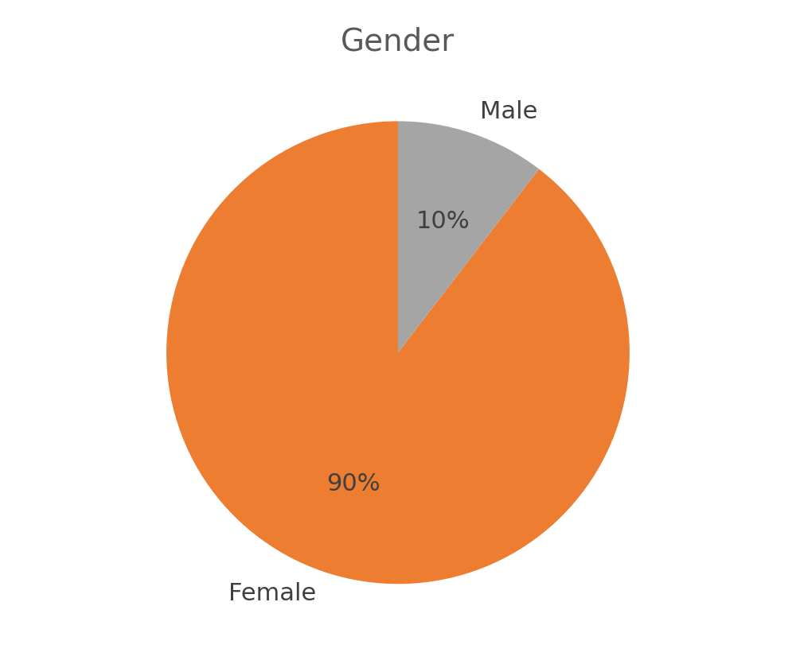
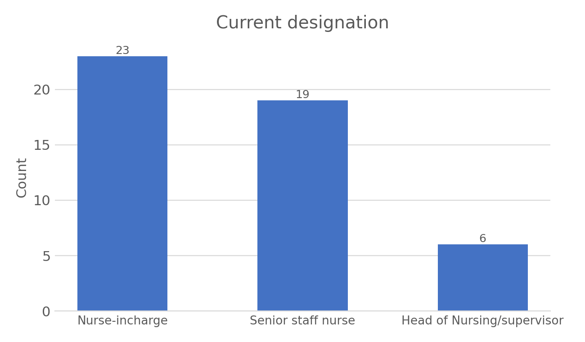
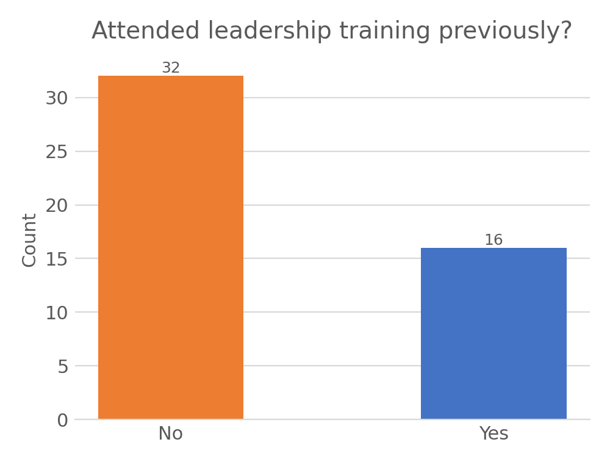
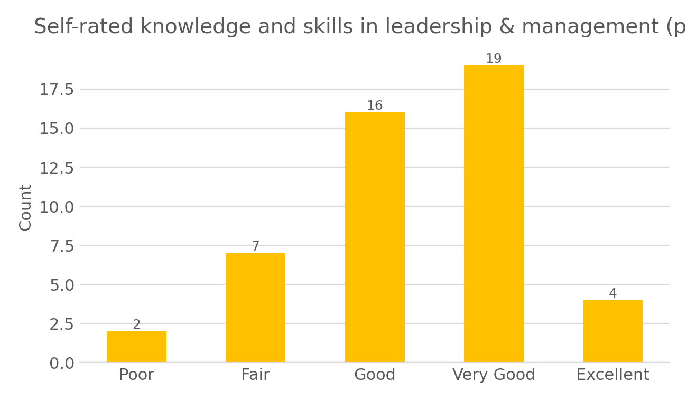
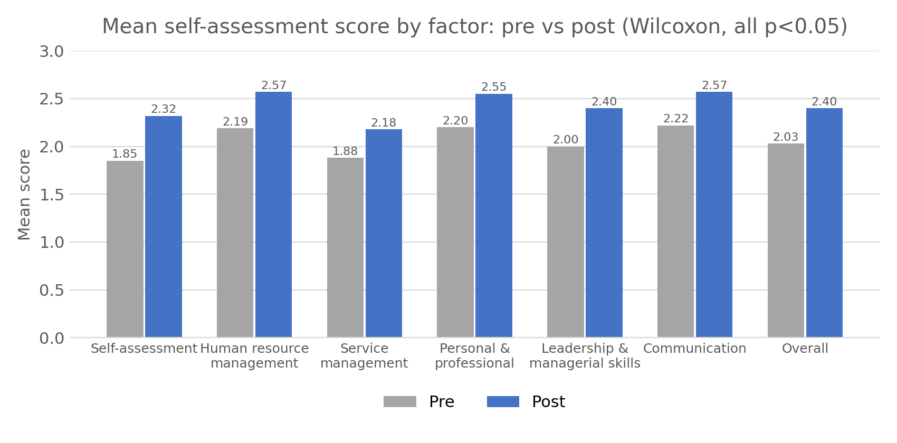
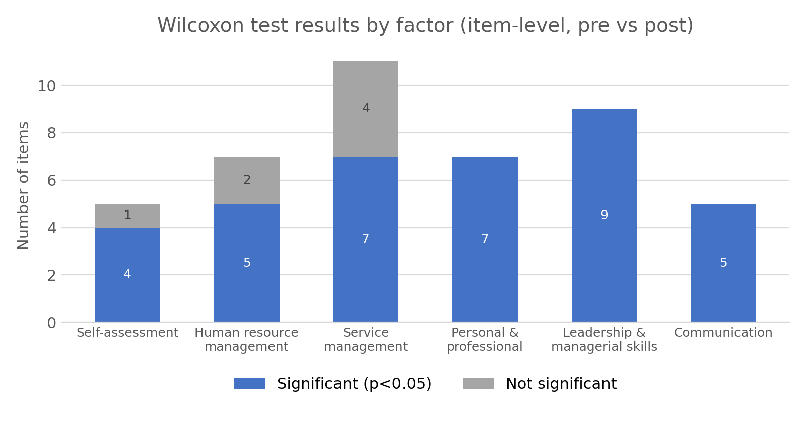
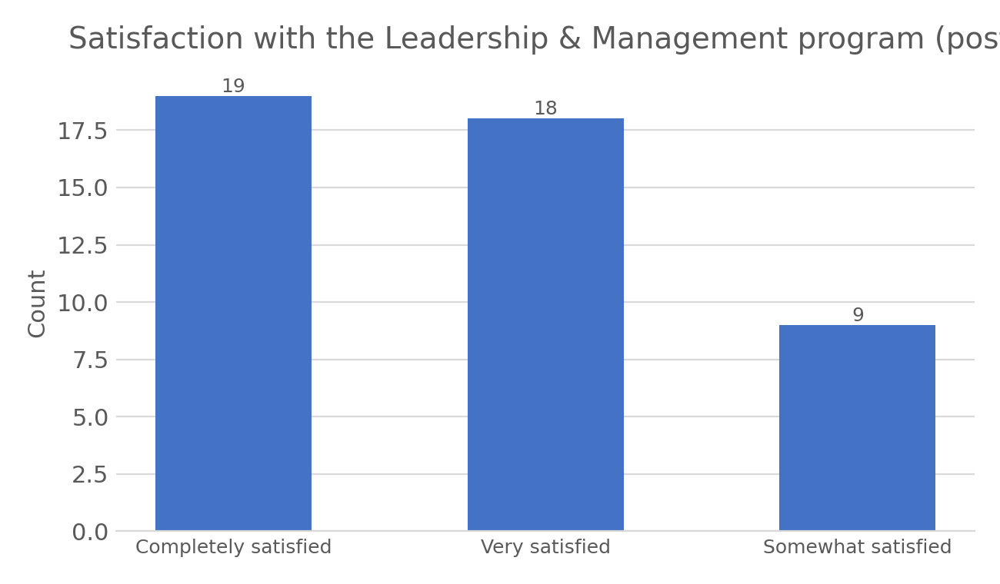

# Evaluating a Leadership and Management Program for Nurse Leaders in Oman (Pre/Post)

> Did a one-year leadership and management training program improve nurse leaders' self-rated competency, and how satisfied were participants with it? A quasi-experimental pre/post evaluation of 48 nurse leaders (46 completed both assessments).

## Background
Leadership and management skills are essential for nurse leaders overseeing staff, services and patient care. This project evaluates a one-year structured training program delivered to nurse leaders, measuring self-rated competency before and after the program across six leadership domains, and participants' satisfaction with the program itself.

## Data
- Pre-test: **48 participants**. Post-test: **46 participants** (2 did not complete the post-assessment).
- Self-rated competency on 45 items across six factors, each rated **Novice / Competent / Expert**:

| Factor | Items |
|---|---|
| Self-assessment (planning) | 6 |
| Human resource management | 7 |
| Service management | 11 |
| Personal & professional qualities | 7 |
| Leadership and managerial skills | 9 |
| Communication | 5 |

- Demographics: age, nationality, gender, years of experience, health institution, current designation, prior leadership training, self-rated knowledge.
- Post-test also included a 30-item program satisfaction scale (Strongly agree to Neutral) and an overall satisfaction question.
- The survey data is **not included** in this repository because it contains individually identifiable responses (participant comments, free-text answers).

## Methodology
1. Descriptive statistics for demographics and pre-test self-ratings.
2. Competency items scored 1 (Novice) to 3 (Expert) and compared pre vs post using the **Wilcoxon signed-rank test** (paired, non-parametric), used because the post-test scores did not meet the normality assumption required for a paired t-test.
3. Satisfaction scale items (1-5) averaged per question and classified using a 5-point agreement scale (1.00-1.80 strongly disagree to 4.21-5.00 strongly agree).

## Results

### Participants




- Mean age 37.9 years (SD 4.6, range 30-51); mean experience 16.3 years (SD 4.6, range 9-27).

 

- 90% female, 10% male; 88% Omani, 12% non-Omani.



- Nurse-in-charge (48%) and senior staff nurse (40%) were the most common designations; head of nursing/supervisor (13%).



- 67% had never attended leadership/management training before the program.



- Before the program, self-rated knowledge was mostly "Very good" (40%) or "Good" (33%).

### Competency: pre vs post



Mean competency score (1 = Novice, 3 = Expert) increased in every factor after the program:

| Factor | Pre mean | Post mean | Z | p |
|---|---|---|---|---|
| Self-assessment | 1.85 | 2.32 | -4.60 | <0.001 |
| Human resource management | 2.19 | 2.57 | -3.80 | <0.001 |
| Service management | 1.88 | 2.18 | -3.31 | 0.001 |
| Personal & professional qualities | 2.20 | 2.55 | -3.87 | <0.001 |
| Leadership and managerial skills | 2.00 | 2.40 | -3.65 | <0.001 |
| Communication | 2.22 | 2.57 | -3.72 | <0.001 |
| **Overall** | **2.03** | **2.40** | **-4.20** | **<0.001** |



At the individual item level, 37 of 45 items improved significantly (p < 0.05). All 9 items in "Leadership and managerial skills" and all 7 in "Personal & professional qualities" improved significantly; "Service management" had the most non-significant items (4 of 11), including managing clinical areas during emergencies/disasters and understanding payment issues affecting organizational finance.

### Program satisfaction


- 96% of participants were completely, very or somewhat satisfied with the program (0% dissatisfied).
- Across the 30-item satisfaction scale, the average score was **4.5 out of 5** ("strongly agree" on every item), with the highest-rated items being trainer expertise (mean 4.64) and improved self-awareness (mean 4.67).

## Limitations
- Small sample (48 pre / 46 post) from a single training cohort, with no control group, so improvement cannot be fully separated from other factors (e.g. maturation, concurrent experience).
- Self-reported competency ratings, which may be subject to social desirability bias, especially post-training.
- The source report references Cronbach's alpha, Cohen's d, chi-square and ANOVA in its methodology section, but only the Wilcoxon test results and descriptive statistics are reported with values; those other analyses are not included here.
- Several respondent categories in the raw data used inconsistent capitalization or wording for the same answer (e.g. satisfaction levels), which were merged for the charts in this repository; this should be corrected in the source data.
- Multiple significance tests (45 items) were run without a multiple-testing correction.

## Repository structure
```
├── README.md
├── Leadership_program_pre_post_analysis.pdf   # full analysis report
└── images/                                    # charts used in this README
```

## Tools
- IBM SPSS Statistics
- Microsoft Excel
